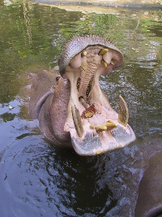

%Title
%Thomas C. Hicks, MD, MPH - 秦汉，医学博士，公共卫生硕士
%2018年

# Introduction

### Introduction - 自我介绍

* American pediatrician - 美国儿科医生
* Lived in China for 22 years - 在中国生活22年
* Married for 28 years (prettiest surgeon in Northwest China!) - 结婚28年（中国西北最美的外科医生）
* Two daughters (23 and 17 years old) - 有两个女儿（一个23岁，一个17岁）

### Family - 家庭

<!--ToDo: Update this photo-->

# First topic
\frame{\tableofcontents[hideothersubsections]}

## First topic - first subtopic

### First topic - first subtopic - first slide

Topic Topic Topic

## First topic - second subtopic

### First topic - second subtopic - first slide

Second subtopic, first slide

# Second topic
\frame{\tableofcontents[hideothersubsections]}

## Second topic - first subtopic

### Second topic - first subtopic - first slide

stuff stuff stuff

### Second topic - first subtopic - second slide

stuff

# Questions?

### Questions? 提问题?

